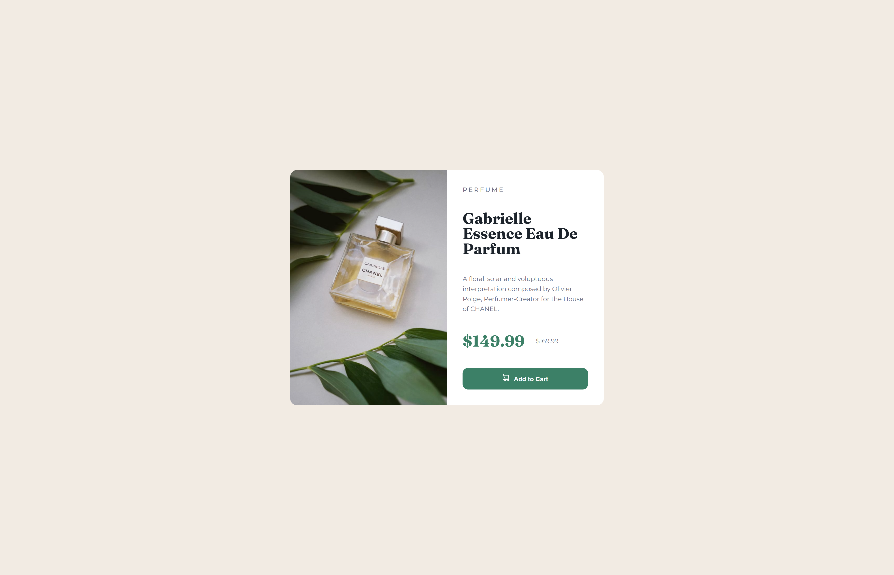

# 🛍️ Product Preview Card by Frontend Mentor

Hey, world! 👋  
This is my ✨**Product Preview Card**✨  a solution to the [Product preview card component challenge on Frontend Mentor — a user interface component built with pure **HTML and CSS**, designed to showcase a product with style and simplicity. 

---

## 💡 About the Project

The idea is simple: create a mini product showcase with title, description, price, and a shiny "Add to Cart" button. Great for e-commerce, portfolios, or any situation where you want to show off an item in a clean, elegant way.

📦 **Built with:**
- HTML5 (semantic and clean)
- CSS (fully responsive)
- Google Fonts (modern typography)
- SVG icon for the cart 🛒

---

## 🎯 What I Learned

- How to build semantic HTML structures (`<article>`, `<h2>`, etc.)
- Use **CSS Grid** to create column layouts
- Add **media queries** for mobile responsiveness
- Style fonts, spacing, and colors like a real designer 🎨
- Integrate SVG icons and make the button interactive

---

## 🔍 Preview




📱 Fully responsive from desktop to mobile. It adapts beautifully. ✨

---

## 🚀 How to Run

Clone this repository:

```bash
git clone https://github.com/cristianersantos/product-preview-card

## 🌐 Live Preview

**Or you can visit here** 👉 [Click to see the live version](https://cristianersantos.github.io/preview-card-component/)

---

## 👩‍💻 About Me

I'm **Cristiane Santos**, just starting my web dev journey — and already loving the magic of code! 💻✨  
Every line of HTML and CSS feels like a step into a new universe! 🌌

- 🚀 GitHub: [@cristianersantos](https://github.com/cristianersantos)  
- 💼 LinkedIn: [Cristiane Santos](https://www.linkedin.com/in/cristianesantossp/)


